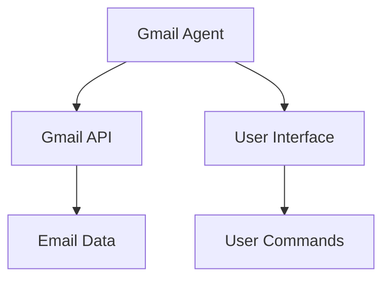
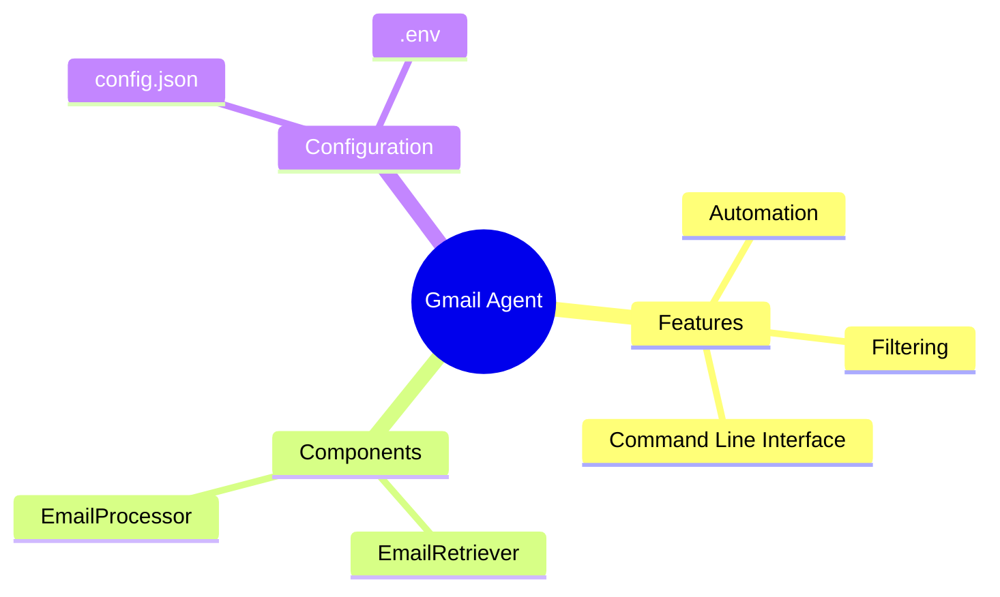

# Gmail Agent 📧

Gmail Agent is a Python-based application designed to automate email handling tasks within Gmail. It leverages the Gmail API to interact with users' inboxes, allowing for efficient email management and processing. The project stands out due to its simplicity and effectiveness in automating repetitive email tasks, making it a valuable tool for users looking to enhance their productivity.

---

## ✨ Key Features
- Automates email retrieval and processing using the Gmail API.- Supports filtering and sorting of emails based on user-defined criteria.- Allows for automated responses to common inquiries.- Provides a simple command-line interface for ease of use.- Lightweight and efficient, with a minimal memory footprint.
---

## 🛠️ Tech Stack & Tools

| Category | Technologies |
|----------|-------------|
| **Backend** | Python |
| **DevOps & Tools** | Git, GmailAPi, GeminiAPI|

---

## 🏗️ Architecture

The architecture of Gmail Agent is designed around a single-layer application that interacts directly with the Gmail API. The core functionality is encapsulated within Python scripts that handle authentication, email retrieval, and processing. This straightforward design ensures that the application remains lightweight while providing the necessary features for effective email management.



---

## 📦 Component Descriptions

| Component | Description |
|-----------|-------------|
| **EmailRetriever** | Handles the retrieval of emails from the user's Gmail account using the Gmail API. |
| **EmailProcessor** | Processes the retrieved emails based on predefined rules and user commands. |
|**EmailDrafter**| Drafts a reply for the email chain and stores it in the drafts. |

---

## 📂 Project Structure

```
Gmail_Agent/
├── agent.py
├── config.json
└── requirements.txt
```

---

## 🚀 Setup & Installation
1. **Clone the repository:**
```bash
git clone https://github.com/abh1shekChoudhary/Gmail_Agent
cd Gmail_Agent
```
2. **Install dependencies:**
```bash
pip install -r requirements.txt
```
3. **Configure environment variables:**
Create a `.env` file with the required variables for Gmail API authentication.4. **Run the application:**
```bash
python agent.py
```
---

## 💡 Usage Examples

To use Gmail Agent, first configure your Gmail API credentials in the `.env` file. Then, run the application using the command `python agent.py`. The application will retrieve your emails and process them according to the defined rules. You can customize the behavior by modifying the `config.json` file.

---

## 🔧 Configuration

The `config.json` file allows the agent to retrieve the memory from its previous run and get more context, such as filters and response templates. Users can customize these settings to tailor the application to their specific needs.

---

## 🧠 Project Mind Map



---


<p align="center">
  Made by <a href="https://github.com/abh1shekChoudhary">Abhishek Choudhary</a>
</p>
